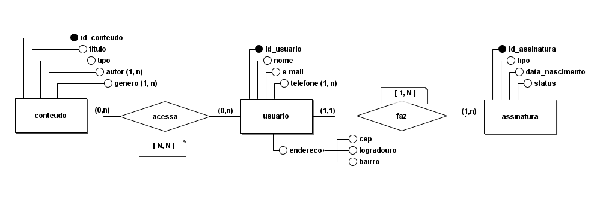
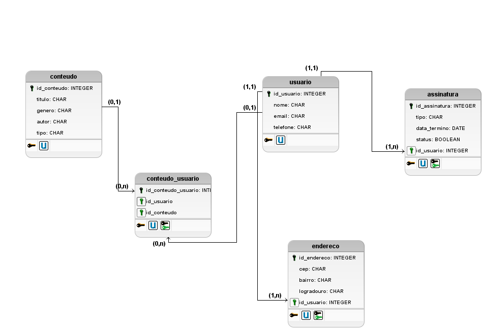

# Estudo de Caso: Sistema de Gerenciamento de Conteúdo Digital - BookStream

## Descrição do Problema

A **BookStream** é uma empresa inovadora que deseja criar um sistema para gerenciar empréstimos de livros digitais (e-books) e audiolivros. O objetivo é permitir que os usuários acessem e façam streaming de conteúdo após realizarem cadastro e adquirirem uma assinatura. Inspirada em plataformas de streaming de vídeo, a BookStream busca mudar a maneira de acessar os livros.

## Objetivos de Aprendizagem

Com este estudo de caso, os alunos deverão ser capazes de:

1. **Analisar Requisitos**  
   - Realizar uma entrevista com o cliente utilizando um questionário preexistente para identificar as funcionalidades esperadas pela BookStream.

2. **Modelar Banco de Dados**  
   - Desenvolver as modelagens de banco de dados nas etapas:
     - **Modelo Conceitual:** Identificar as entidades, atributos e relacionamentos fundamentais.
     - **Modelo Lógico:** Estruturar o modelo com as relações e chaves.
     - **Modelo Físico:** Implementar o banco de dados, considerando as tecnologias e otimizações necessárias para o BookStream.

---

## Solução

### Perguntas para o levantamento de Requisitos
1. Quais informações precisam ser armazenadas sobre os usuários?
   
   Resposta: Precisamos armazenar o nome, e-mail, senha, data de nascimento, endereço e o status da assinatura (ativa ou inativa).

2. Como funcionará o sistema de assinatura dos usuários?

   Resposta: Os usuários precisarão adquirir uma assinatura mensal ou anual para ter acesso ao conteúdo. A assinatura será renovada automaticamente, e o sistema deve controlar a validade da assinatura.

3. Quantos dispositivos podem acessar o conteúdo ao mesmo tempo com uma única assinatura?

   Resposta: No momento, cada usuário pode acessar o conteúdo em apenas um único dispositivo ao mesmo tempo.

4. Há alguma limitação quanto ao número de conteúdos que um usuário pode acessar por vez?

   Resposta: Não há limite para o número de conteúdos, desde que seja dentro dos dispositivos permitidos e que o usuário possua uma assinatura ativa.

5. Quais informações serão armazenadas sobre os livros digitais e audiolivros?

   Resposta: Precisamos armazenar o título, autor, tipo de conteúdo (e-book ou audiolivro), gênero, número de páginas ou duração.

6. O sistema precisa controlar downloads e streaming?

   Resposta: Não, os usuários poderão acessar o conteúdo apenas via streaming na plataforma, sem opção de download.

7. O sistema deve permitir recomendações personalizadas para os usuários?

   Resposta: Sim, o sistema deve sugerir novos conteúdos com base no histórico de empréstimos e nas preferências do usuário (por exemplo, gênero ou autor favorito).

8. Como os usuários poderão buscar e filtrar os conteúdos disponíveis?

   Resposta: O sistema deve permitir que os usuários busquem por título, autor, gênero e avaliações. Também deve incluir filtros para categorias, como “mais populares” ou “novidades”.

9. Como será o processo de notificação para os usuários sobre a validade da assinatura?

   Resposta: O sistema enviará notificações por e-mail ou através da plataforma, lembrando os usuários sobre a validade da assinatura e avisando sobre renovações ou falhas de pagamento.

10. O sistema precisa limitar o tempo de inatividade antes de desconectar automaticamente o usuário?
    
    Resposta: Sim, por razões de segurança, o sistema deve desconectar automaticamente após 30 minutos de inatividade.

---

### Modelo conceitual

---

### Modelo lógico

---

#### Autor

